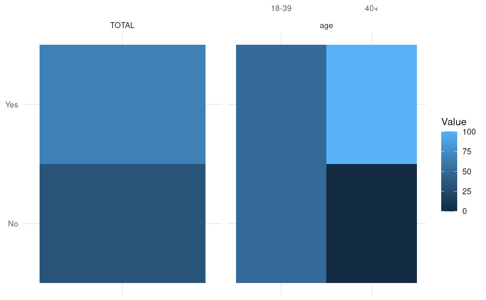

# Format of the crosstabs' data

In this vignette we’ll show the underlying data format of the crosstabs
generated by crosstabser. Basically, it’s a long format of [tidy
data](https://r4ds.had.co.nz/tidy-data.html) such as the one needed if
you’d want to plot the crosstab with
[ggplot2](https://github.com/tidyverse/ggplot2/) or [observable
plot](https://github.com/observablehq/plot) (like in
[table_charter](https://gitlab.com/urswilke/table_charter); see
[here](https://urswilke.github.io/datadaptor-crosstabser-table_charter-demo/)
for an interactive demo). However, in order to reduce redundancy and to
save space we store the data in multiple data.frames that can be merged
together in the end. First, let’s load the needed libraries:

[`library`](https://rdrr.io/r/base/library.html)`(`[`crosstabser`](https://urswilke.codeberg.page/crosstabser)`)`` `[`library`](https://rdrr.io/r/base/library.html)`(`[`dplyr`](https://dplyr.tidyverse.org)`)`` `[`library`](https://rdrr.io/r/base/library.html)`(`[`ggplot2`](https://ggplot2.tidyverse.org)`)`` `[`library`](https://rdrr.io/r/base/library.html)`(`[`purrr`](https://purrr.tidyverse.org/)`)`` `[`library`](https://rdrr.io/r/base/library.html)`(`[`tidyr`](https://tidyr.tidyverse.org)`)`` `[`library`](https://rdrr.io/r/base/library.html)`(`[`haven`](https://haven.tidyverse.org)`)`

and define a labelled data.frame:

`df`` ``<-`` ``tibble``::`[`tibble`](https://tibble.tidyverse.org/reference/tibble.html)`(`` `` q1 ``=`` `[`c`](https://rdrr.io/r/base/c.html)`(``1``, ``2``, ``1``)`` ``|>`` ``haven``::`[`labelled`](https://haven.tidyverse.org/reference/labelled.html)`(`[`c`](https://rdrr.io/r/base/c.html)`(``Yes ``=`` ``1``, No ``=`` ``2``)``, label ``=`` ``"Super important question"``)``,`` `` age ``=`` `[`c`](https://rdrr.io/r/base/c.html)`(``2``, ``1``, ``1``)`` ``|>`` ``haven``::`[`labelled`](https://haven.tidyverse.org/reference/labelled.html)`(`[`c`](https://rdrr.io/r/base/c.html)`(``"18-39"`` ``=`` ``1``, ``"40+"`` ``=`` ``2``)``, label ``=`` ``"age"``)`` ``)`` ``df`` ``#> ``# A tibble: 3 × 2`` ``#> q1 age `` ``#> ``<dbl+lbl>`` ``<dbl+lbl>`` ``#> ``1`` 1`` [Yes]`` 2`` [40+]`` `` ``#> ``2`` 2`` [No]`` 1`` [18-39]`` ``#> ``3`` 1`` [Yes]`` 1`` [18-39]`

Next we define the syntax to generate a crosstab:

`Questions`` ``<-`` ``tibble``::`[`tibble`](https://tibble.tidyverse.org/reference/tibble.html)`(`` `` Type ``=`` ``"cat"``,`` `` RowVar ``=`` ``"q1"``,`` `` Title ``=`` ``"The crosstab's title"`` ``)`

We’ll use the `age` variable for the x-axis of the crosstab:

`ColVar`` ``<-`` ``"age"`

Now we can construct an R6 object of class “Tabula”:

`mapping_file`` ``<-`` `[`list`](https://rdrr.io/r/base/list.html)`(``Questions ``=`` ``Questions``, Macro ``=`` `[`list`](https://rdrr.io/r/base/list.html)`(``ColVar ``=`` ``ColVar``)``)`` ``m`` ``<-`` `[`Tabula`](https://urswilke.codeberg.page/crosstabser/reference/Tabula.md)`$``new``(`` `` ``df``,`` `` ``mapping_file``,`` ``)`

The `Tabula$get_crosstabs_data()` method returns a list of dataframes
containing the crosstabs’ underlying data:

`l`` ``<-`` ``m``$``get_crosstabs_data``(``)`` ``l`` ``#> $tab_table`` ``#> ``# A tibble: 1 × 15`` ``#> BookNo QuestNo TabName QuestLine TabNo TabType TabTitle TabTitle1 TabTitle2`` ``#> ``<dbl>`` ``<chr>`` ``<chr>`` ``<dbl>`` ``<int>`` ``<chr>`` ``<chr>`` ``<chr>`` ``<chr>`` `` ``#> ``1`` 999``999``999 _row_2 CAT#_r… 2 1 CAT The cro… The cros… The cros…`` ``#> ``# ℹ 6 more variables: TabTitle3 <chr>, TabCaption <chr>, SelVal <chr>,`` ``#> ``# repov_name <chr>, TabCount <int>, TabRowTypes <int>`` ``#> `` ``#> $val_table`` ``#> ``# A tibble: 21 × 6`` ``#> BookNo QuestNo TabNo RowNo ColNo Value`` ``#> ``<dbl>`` ``<chr>`` ``<int>`` ``<int>`` ``<int>`` ``<dbl>`` ``#> `` 1`` 999``999``999 _row_2 1 4 4 3 `` ``#> `` 2`` 999``999``999 _row_2 1 4 5 2 `` ``#> `` 3`` 999``999``999 _row_2 1 4 6 1 `` ``#> `` 4`` 999``999``999 _row_2 1 5 4 2 `` ``#> `` 5`` 999``999``999 _row_2 1 5 5 1 `` ``#> `` 6`` 999``999``999 _row_2 1 5 6 1 `` ``#> `` 7`` 999``999``999 _row_2 1 6 4 66.7`` ``#> `` 8`` 999``999``999 _row_2 1 6 5 50 `` ``#> `` 9`` 999``999``999 _row_2 1 6 6 100 `` ``#> ``10`` 999``999``999 _row_2 1 7 4 1 `` ``#> ``# ℹ 11 more rows`` ``#> `` ``#> $row_table`` ``#> ``# A tibble: 11 × 18`` ``#> BookNo RowNo RowContent RowAbsPercent RowWeighted TabNo RowTitle1 RowTitle2`` ``#> ``<dbl>`` ``<int>`` ``<chr>`` ``<chr>`` ``<chr>`` ``<int>`` ``<chr>`` ``<chr>`` `` ``#> `` 1`` 1.000``e``9 1 Title ``""`` ``""`` 1 ``"``The cro… ``""`` `` ``#> `` 2`` 1.000``e``9 2 Header ``""`` ``""`` 1 ``NA`` ``""`` `` ``#> `` 3`` 1.000``e``9 3 Header ``""`` ``""`` 1 ``NA`` ``""`` `` ``#> `` 4`` 1.000``e``9 4 Total ``"``Abs``"`` ``"``Unweighte… 1 ``"``TOTAL``"`` ``"``TOTAL``"`` `` ``#> `` 5`` 1.000``e``9 5 Detail ``"``Abs``"`` ``"``Unweighte… 1 ``"``Yes``"`` ``"``Yes``"`` `` ``#> `` 6`` 1.000``e``9 6 Detail ``"``Percent``"`` ``"``Unweighte… 1 ``"``Yes``"`` ``"``Yes``"`` `` ``#> `` 7`` 1.000``e``9 7 Detail ``"``Abs``"`` ``"``Unweighte… 1 ``"``No``"`` ``"``No``"`` `` ``#> `` 8`` 1.000``e``9 8 Detail ``"``Percent``"`` ``"``Unweighte… 1 ``"``No``"`` ``"``No``"`` `` ``#> `` 9`` 1.000``e``9 9 Valid ``"``Abs``"`` ``"``Unweighte… 1 ``"``VALID C… ``"``VALID C…`` ``#> ``10`` 1.000``e``9 10 Valid ``"``Percent``"`` ``"``Unweighte… 1 ``"``VALID C… ``"``VALID C…`` ``#> ``11`` 1.000``e``9 11 Empty ``""`` ``""`` 1 ``""`` ``""`` `` ``#> ``# ℹ 10 more variables: RowTitle3 <chr>, RowFormat <chr>, RowDecimals <int>,`` ``#> ``# RowVariable <chr>, RowValue <dbl>, row_type <chr>, QuestNo <chr>,`` ``#> ``# RowTypeS <chr>, RowType <int>, RowContentDetail <chr>`` ``#> `` ``#> $head_table`` ``#> ``# A tibble: 5 × 5`` ``#> BookNo HeadNo HeadName HeadTitle HeadCount`` ``#> ``<dbl>`` ``<int>`` ``<chr>`` ``<chr>`` ``<int>`` ``#> ``1`` 999``999``999 1 DC#ROWHEADER ``NA`` 3`` ``#> ``2`` 999``999``999 2 DC#TOTAL TOTAL 1`` ``#> ``3`` 999``999``999 3 age@1 age 2`` ``#> ``4`` 999``999``999 4 DC#EMPTY ``NA`` 1`` ``#> ``5`` 999``999``999 5 DC#TITLE ``NA`` 1`` ``#> `` ``#> $col_table_all`` ``#> BookNo ColNo HeadNo ColTitle1 ColTitle2 ColVariable ColValue`` ``#> 1 1e+09 1 1 DC#ROWHEADER NA`` ``#> 2 1e+09 2 1 DC#ROWHEADER NA`` ``#> 3 1e+09 3 1 DC#ROWHEADER NA`` ``#> 4 1e+09 4 2 TOTAL DC#TOTAL 1`` ``#> 5 1e+09 5 3 age 18-39 age 1`` ``#> 6 1e+09 6 3 age 40+ age 2`` ``#> 7 1e+09 7 4 DC#EMPTY NA`` ``#> 8 1e+09 8 5 DC#TITLE NA`

It contains 5 data.frames:

- `tab_table`: For every crosstab generated, this dataframe contains 1
  row; `QuestNo` is the unique identifier from `Questions$Abbreviation`;
  if multiple crosstabs are generated by a row, they are identified by
  `TabNo`.
- `val_table`: Contains the values of the crosstabs in long format in
  the column `Value`.
- `row_table`: Contains the label information of the crosstabs’ rows and
  some information about the format in the rows.
- `head_table`: Contains the label information of the crosstabs’
  headers.
- `col_table_all`: Contains the label information of the crosstabs’
  columns.

Now we’re ready to merge all this data into one data.frame:

`res`` ``<-`` ``l``[`[`c`](https://rdrr.io/r/base/c.html)`(`` `` ``"tab_table"``, `` `` ``"val_table"``, `` `` ``"row_table"``, `` `` ``"col_table_all"``,`` `` ``"head_table"`` ``)``]`` ``|>`` `` `` `[`reduce`](https://purrr.tidyverse.org/reference/reduce.html)`(``left_join``)`` ``` #> Joining with `by = join_by(BookNo, QuestNo, TabNo)` ``` ``` #> Joining with `by = join_by(BookNo, QuestNo, TabNo, RowNo)` ``` ``` #> Joining with `by = join_by(BookNo, ColNo)` ``` ``` #> Joining with `by = join_by(BookNo, HeadNo)` ``

Click here to see the full data.frame

`knitr``::`[`kable`](https://rdrr.io/pkg/knitr/man/kable.html)`(``res``)`

| BookNo | QuestNo | TabName | QuestLine | TabNo | TabType | TabTitle | TabTitle1 | TabTitle2 | TabTitle3 | TabCaption | SelVal | repov_name | TabCount | TabRowTypes | RowNo | ColNo | Value | RowContent | RowAbsPercent | RowWeighted | RowTitle1 | RowTitle2 | RowTitle3 | RowFormat | RowDecimals | RowVariable | RowValue | row_type | RowTypeS | RowType | RowContentDetail | HeadNo | ColTitle1 | ColTitle2 | ColVariable | ColValue | HeadName | HeadTitle | HeadCount |
|---:|:---|:---|---:|---:|:---|:---|:---|:---|:---|:---|:---|:---|---:|---:|---:|---:|---:|:---|:---|:---|:---|:---|:---|:---|---:|:---|---:|:---|:---|---:|:---|---:|:---|:---|:---|---:|:---|:---|---:|
| 1e+09 | \_row_2 | <CAT#_row_2@1> | 2 | 1 | CAT | The crosstab’s title | The crosstab’s title | The crosstab’s title | The crosstab’s title | NA | NA | NA | 11 | NA | 4 | 4 | 3.00000 | Total | Abs | Unweighted | TOTAL | TOTAL | abs | NA | 0 | q1 | 1 | total | Total\|AbsUnweighted | 2097408 |  | 2 | TOTAL |  | DC#TOTAL | 1 | DC#TOTAL | TOTAL | 1 |
| 1e+09 | \_row_2 | <CAT#_row_2@1> | 2 | 1 | CAT | The crosstab’s title | The crosstab’s title | The crosstab’s title | The crosstab’s title | NA | NA | NA | 11 | NA | 4 | 5 | 2.00000 | Total | Abs | Unweighted | TOTAL | TOTAL | abs | NA | 0 | q1 | 1 | total | Total\|AbsUnweighted | 2097408 |  | 3 | age | 18-39 | age | 1 | <age@1> | age | 2 |
| 1e+09 | \_row_2 | <CAT#_row_2@1> | 2 | 1 | CAT | The crosstab’s title | The crosstab’s title | The crosstab’s title | The crosstab’s title | NA | NA | NA | 11 | NA | 4 | 6 | 1.00000 | Total | Abs | Unweighted | TOTAL | TOTAL | abs | NA | 0 | q1 | 1 | total | Total\|AbsUnweighted | 2097408 |  | 3 | age | 40+ | age | 2 | <age@1> | age | 2 |
| 1e+09 | \_row_2 | <CAT#_row_2@1> | 2 | 1 | CAT | The crosstab’s title | The crosstab’s title | The crosstab’s title | The crosstab’s title | NA | NA | NA | 11 | NA | 5 | 4 | 2.00000 | Detail | Abs | Unweighted | Yes | Yes | abs | NA | 0 | q1 | 1 | detail_freqs_valid | Detail\|AbsUnweighted | 2097168 |  | 2 | TOTAL |  | DC#TOTAL | 1 | DC#TOTAL | TOTAL | 1 |
| 1e+09 | \_row_2 | <CAT#_row_2@1> | 2 | 1 | CAT | The crosstab’s title | The crosstab’s title | The crosstab’s title | The crosstab’s title | NA | NA | NA | 11 | NA | 5 | 5 | 1.00000 | Detail | Abs | Unweighted | Yes | Yes | abs | NA | 0 | q1 | 1 | detail_freqs_valid | Detail\|AbsUnweighted | 2097168 |  | 3 | age | 18-39 | age | 1 | <age@1> | age | 2 |
| 1e+09 | \_row_2 | <CAT#_row_2@1> | 2 | 1 | CAT | The crosstab’s title | The crosstab’s title | The crosstab’s title | The crosstab’s title | NA | NA | NA | 11 | NA | 5 | 6 | 1.00000 | Detail | Abs | Unweighted | Yes | Yes | abs | NA | 0 | q1 | 1 | detail_freqs_valid | Detail\|AbsUnweighted | 2097168 |  | 3 | age | 40+ | age | 2 | <age@1> | age | 2 |
| 1e+09 | \_row_2 | <CAT#_row_2@1> | 2 | 1 | CAT | The crosstab’s title | The crosstab’s title | The crosstab’s title | The crosstab’s title | NA | NA | NA | 11 | NA | 6 | 4 | 66.66667 | Detail | Percent | Unweighted | Yes | Yes | in % | NA | 1 | q1 | 1 | detail_perc_valid | Detail\|PercentUnweighted | 33554448 |  | 2 | TOTAL |  | DC#TOTAL | 1 | DC#TOTAL | TOTAL | 1 |
| 1e+09 | \_row_2 | <CAT#_row_2@1> | 2 | 1 | CAT | The crosstab’s title | The crosstab’s title | The crosstab’s title | The crosstab’s title | NA | NA | NA | 11 | NA | 6 | 5 | 50.00000 | Detail | Percent | Unweighted | Yes | Yes | in % | NA | 1 | q1 | 1 | detail_perc_valid | Detail\|PercentUnweighted | 33554448 |  | 3 | age | 18-39 | age | 1 | <age@1> | age | 2 |
| 1e+09 | \_row_2 | <CAT#_row_2@1> | 2 | 1 | CAT | The crosstab’s title | The crosstab’s title | The crosstab’s title | The crosstab’s title | NA | NA | NA | 11 | NA | 6 | 6 | 100.00000 | Detail | Percent | Unweighted | Yes | Yes | in % | NA | 1 | q1 | 1 | detail_perc_valid | Detail\|PercentUnweighted | 33554448 |  | 3 | age | 40+ | age | 2 | <age@1> | age | 2 |
| 1e+09 | \_row_2 | <CAT#_row_2@1> | 2 | 1 | CAT | The crosstab’s title | The crosstab’s title | The crosstab’s title | The crosstab’s title | NA | NA | NA | 11 | NA | 7 | 4 | 1.00000 | Detail | Abs | Unweighted | No | No | abs | NA | 0 | q1 | 2 | detail_freqs_valid | Detail\|AbsUnweighted | 2097168 |  | 2 | TOTAL |  | DC#TOTAL | 1 | DC#TOTAL | TOTAL | 1 |
| 1e+09 | \_row_2 | <CAT#_row_2@1> | 2 | 1 | CAT | The crosstab’s title | The crosstab’s title | The crosstab’s title | The crosstab’s title | NA | NA | NA | 11 | NA | 7 | 5 | 1.00000 | Detail | Abs | Unweighted | No | No | abs | NA | 0 | q1 | 2 | detail_freqs_valid | Detail\|AbsUnweighted | 2097168 |  | 3 | age | 18-39 | age | 1 | <age@1> | age | 2 |
| 1e+09 | \_row_2 | <CAT#_row_2@1> | 2 | 1 | CAT | The crosstab’s title | The crosstab’s title | The crosstab’s title | The crosstab’s title | NA | NA | NA | 11 | NA | 7 | 6 | 0.00000 | Detail | Abs | Unweighted | No | No | abs | NA | 0 | q1 | 2 | detail_freqs_valid | Detail\|AbsUnweighted | 2097168 |  | 3 | age | 40+ | age | 2 | <age@1> | age | 2 |
| 1e+09 | \_row_2 | <CAT#_row_2@1> | 2 | 1 | CAT | The crosstab’s title | The crosstab’s title | The crosstab’s title | The crosstab’s title | NA | NA | NA | 11 | NA | 8 | 4 | 33.33333 | Detail | Percent | Unweighted | No | No | in % | NA | 1 | q1 | 2 | detail_perc_valid | Detail\|PercentUnweighted | 33554448 |  | 2 | TOTAL |  | DC#TOTAL | 1 | DC#TOTAL | TOTAL | 1 |
| 1e+09 | \_row_2 | <CAT#_row_2@1> | 2 | 1 | CAT | The crosstab’s title | The crosstab’s title | The crosstab’s title | The crosstab’s title | NA | NA | NA | 11 | NA | 8 | 5 | 50.00000 | Detail | Percent | Unweighted | No | No | in % | NA | 1 | q1 | 2 | detail_perc_valid | Detail\|PercentUnweighted | 33554448 |  | 3 | age | 18-39 | age | 1 | <age@1> | age | 2 |
| 1e+09 | \_row_2 | <CAT#_row_2@1> | 2 | 1 | CAT | The crosstab’s title | The crosstab’s title | The crosstab’s title | The crosstab’s title | NA | NA | NA | 11 | NA | 8 | 6 | 0.00000 | Detail | Percent | Unweighted | No | No | in % | NA | 1 | q1 | 2 | detail_perc_valid | Detail\|PercentUnweighted | 33554448 |  | 3 | age | 40+ | age | 2 | <age@1> | age | 2 |
| 1e+09 | \_row_2 | <CAT#_row_2@1> | 2 | 1 | CAT | The crosstab’s title | The crosstab’s title | The crosstab’s title | The crosstab’s title | NA | NA | NA | 11 | NA | 9 | 4 | 3.00000 | Valid | Abs | Unweighted | VALID CASES | VALID CASES | abs | NA | 0 | q1 | 1 | n_valid_freqs | Valid\|AbsUnweighted | 2097664 |  | 2 | TOTAL |  | DC#TOTAL | 1 | DC#TOTAL | TOTAL | 1 |
| 1e+09 | \_row_2 | <CAT#_row_2@1> | 2 | 1 | CAT | The crosstab’s title | The crosstab’s title | The crosstab’s title | The crosstab’s title | NA | NA | NA | 11 | NA | 9 | 5 | 2.00000 | Valid | Abs | Unweighted | VALID CASES | VALID CASES | abs | NA | 0 | q1 | 1 | n_valid_freqs | Valid\|AbsUnweighted | 2097664 |  | 3 | age | 18-39 | age | 1 | <age@1> | age | 2 |
| 1e+09 | \_row_2 | <CAT#_row_2@1> | 2 | 1 | CAT | The crosstab’s title | The crosstab’s title | The crosstab’s title | The crosstab’s title | NA | NA | NA | 11 | NA | 9 | 6 | 1.00000 | Valid | Abs | Unweighted | VALID CASES | VALID CASES | abs | NA | 0 | q1 | 1 | n_valid_freqs | Valid\|AbsUnweighted | 2097664 |  | 3 | age | 40+ | age | 2 | <age@1> | age | 2 |
| 1e+09 | \_row_2 | <CAT#_row_2@1> | 2 | 1 | CAT | The crosstab’s title | The crosstab’s title | The crosstab’s title | The crosstab’s title | NA | NA | NA | 11 | NA | 10 | 4 | 100.00000 | Valid | Percent | Unweighted | VALID CASES | VALID CASES | in % | NA | 1 | q1 | 1 | n_valid_perc | Valid\|PercentUnweighted | 33554944 |  | 2 | TOTAL |  | DC#TOTAL | 1 | DC#TOTAL | TOTAL | 1 |
| 1e+09 | \_row_2 | <CAT#_row_2@1> | 2 | 1 | CAT | The crosstab’s title | The crosstab’s title | The crosstab’s title | The crosstab’s title | NA | NA | NA | 11 | NA | 10 | 5 | 100.00000 | Valid | Percent | Unweighted | VALID CASES | VALID CASES | in % | NA | 1 | q1 | 1 | n_valid_perc | Valid\|PercentUnweighted | 33554944 |  | 3 | age | 18-39 | age | 1 | <age@1> | age | 2 |
| 1e+09 | \_row_2 | <CAT#_row_2@1> | 2 | 1 | CAT | The crosstab’s title | The crosstab’s title | The crosstab’s title | The crosstab’s title | NA | NA | NA | 11 | NA | 10 | 6 | 100.00000 | Valid | Percent | Unweighted | VALID CASES | VALID CASES | in % | NA | 1 | q1 | 1 | n_valid_perc | Valid\|PercentUnweighted | 33554944 |  | 3 | age | 40+ | age | 2 | <age@1> | age | 2 |

If we look at the crosstab

`m`` ``` #> $`2` ``` ``` #> $`2`[[1]] ``` ``#> ``# The crosstab's title`` ``#> ``TOTAL`` ``age`` ``-----`` ``#> `` `` ``18-39`` ``40+`` ``#> ``TOTAL abs `` 3 2 1`` ``#> ``Yes abs `` `` 2 `` `` 1`` `` 1`` ``#> `` in % `` 66.7 50 100`` ``#> ``No abs `` `` 1 `` `` 1`` `` 0`` ``#> `` in % `` 33.3 50 0`` ``#> ``VALID CASES abs `` 3 2 1`` ``#> `` in % `` 100 100 100`

and say we wanted to generated a color-coded raster of the percent
values, we could do this like this:

`res`` ``|>`` `` `` `[`filter`](https://dplyr.tidyverse.org/reference/filter.html)`(`` `` ``# This removes the data of the "TOTAL" & "VALID CASES" rows:`` `` ``RowContent`` ``==`` ``"Detail"``, `` `` ``# remove rows with absolute values:`` `` ``RowAbsPercent`` ``==`` ``"Percent"`` `` ``)`` ``|>`` `` `` `[`ggplot`](https://ggplot2.tidyverse.org/reference/ggplot.html)`(``)`` ``+`` `` `[`geom_tile`](https://ggplot2.tidyverse.org/reference/geom_tile.html)`(`[`aes`](https://ggplot2.tidyverse.org/reference/aes.html)`(`` `` x ``=`` ``ColTitle2``,`` `` y ``=`` ``RowTitle1``,`` `` fill ``=`` ``Value`` `` ``)``)`` ``+`` `` `` `[`facet_grid`](https://ggplot2.tidyverse.org/reference/facet_grid.html)`(`` `` ``~`` `[`as_factor`](https://forcats.tidyverse.org/reference/as_factor.html)`(``ColTitle1``)``, `` `` scales ``=`` ``"free_x"`` `` ``)`` ``+`` `` `[`scale_x_discrete`](https://ggplot2.tidyverse.org/reference/scale_discrete.html)`(``position ``=`` ``"top"``)`` ``+`` `` `[`theme_minimal`](https://ggplot2.tidyverse.org/reference/ggtheme.html)`(``)`` ``+`` `` `[`theme`](https://ggplot2.tidyverse.org/reference/theme.html)`(`` `` axis.title.x ``=`` `[`element_blank`](https://ggplot2.tidyverse.org/reference/element.html)`(``)``,`` `` axis.title.y ``=`` `[`element_blank`](https://ggplot2.tidyverse.org/reference/element.html)`(``)`` `` ``)`



(*This plot isn’t really interesting; this is just to demonstrate the
structure of the crosstabs’ underlying data*)
